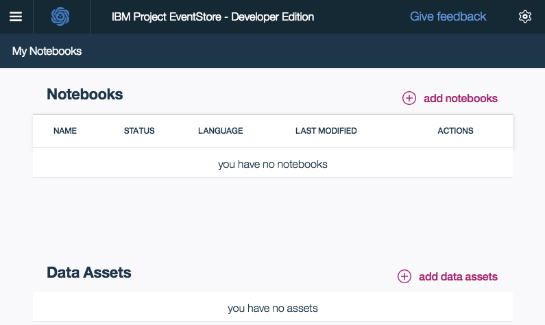
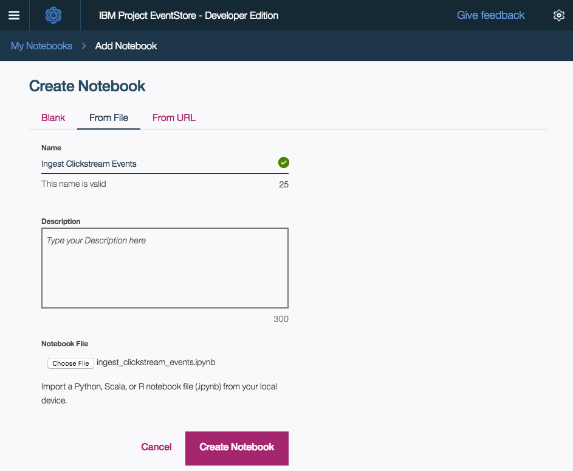

# Clickstream Analysis with IBM Db2 Event Store

IBM Db2 Event Store offers high-speed ingestion and real-time analytics for large
volumes of streaming data. The platform enables event-driven applications to
persist event data at scale and powers high performance Spark analytics on all
data for quick insights. In this Code Pattern, we will see how a retail business
uses IBM Db2 Event Store to capture and analyze clickstream data from its web
channels. The clickstream analysis helps the business to closely track customer
browsing patterns and better understand their changing interests. Acting on these
insights, the business offers a personalized experience for every customer with
targeted offers to drive sales.

Sample Notebooks demonstrate the use case of clickstream analysis with
IBM Db2 Event Store using Scala APIs to ingest and analyze web event data.
Credit goes to [Siva Anne](https://github.com/annesiva) of the [IBM Data Science Elite Team](https://github.com/orgs/IBM-DSE) for the original Jupyter Notebooks.

<!--
Available in a free developer edition and an enterprise edition that
you can download now. The enterprise edition is free for pre-production and test.
-->


When the reader has completed this code pattern, they will understand how to:
* Install IBM Db2 Event Store developer edition
* Use a Scala program to insert into IBM Db2 Event Store
* Interact with Db2 Event Store using Scala and a Jupyter notebook
* Query the Event Store
* Use Brunel to visualize the data with interactive charts

<!--
* Query the database and chart statistics while events are processed
-->


## Flow
1.
2.
3.

## Included components
* [IBM Db2 Event Store](https://www.ibm.com/us-en/marketplace/db2-event-store): In-memory database optimized for event-driven data processing and analysis.
* [Jupyter Notebook](http://jupyter.org/): An open source web application that allows you to create and share documents that contain live code, equations, visualizations, and explanatory text.
* [Scala](https://www.scala-lang.org/): Scala combines object-oriented and functional programming in one concise, high-level language.

## Featured technologies
* [Databases](https://en.wikipedia.org/wiki/Database): Repository for storing and managing collections of data.
* [Analytics](https://developer.ibm.com/watson/): Analytics delivers the value of data for the enterprise.
* [Data Science](https://medium.com/ibm-data-science-experience/): Systems and scientific methods to analyze structured and unstructured data in order to extract knowledge and insights.

<!--
# Watch the Video
[](https://www.youtube.com/watch?v=7R-Q3bxp2rI)
-->

# Steps

## Run locally

1. [Install IBM Db2 Event Store Developer Edition](#1-install-ibm-db2-event-store-developer-edition)
2. [Clone the repo](#2-clone-the-repo)
3. [Add the CSV file as a data asset](#3-add-the-csv-file-as-a-data-asset)
4. [Import the Notebooks](#4-import-the-notebooks)
5. [Run the Jupyter Notebook to ingest data](#5-run-the-jupyter-notebook-to-ingest-data)
6. [Run the Jupyter Notebook to analyze the data](#6-run-the-jupyter-notebook-to-analyze-the-data)

### 1. Install IBM Db2 Event Store Developer Edition

Install IBM® Db2® Event Store Developer Edition on Mac, Linux, or Windows by following the instructions [here.](https://www.ibm.com/support/knowledgecenter/en/SSGNPV/eventstore/desktop/install.html)

> Note: This code pattern was developed with EventStore-DeveloperEdition 1.1.4

### 2. Clone the repo

Clone the `db2-event-store-clickstream` locally. In a terminal, run:

```
git clone https://github.com/IBM/db2-event-store-clickstream
```

### 3. Add the CSV file as a data asset

Use the Db2 Event Store UI to add the CSV input file as a data asset.

1. From the drop down menu (three horizontal lines in the upper left corner), select `My Notebooks`.
   
1. Click on `add data assets`.
   
1. Click `browse` and navigate to the `data` directory in your cloned repo. Select the file `clickstream_data.csv`.
   

### 4. Import the Notebooks

Use the Db2 Event Store UI to create the notebooks.

Create the notebook to ingest the data:

1. From the drop down menu (three horizontal lines in the upper left corner), select `My Notebooks`.
1. Click on `add notebooks`.
1. Select the `From File` tab.
1. Provide a name.
1. Click `Choose File` and navigate to the `notebooks` directory in your cloned repo. Select the file `ingest_clickstream_events.ipynb`.
1. Scroll down and click on `Create Notebook`.
   

Create the notebook to analyze the data:

* Follow the same steps, but select the file `analyze_clickstream_events.ipynb`.

### 5. Run the Jupyter Notebook to ingest data

Use the notebook created from `ingest_clickstream_events.ipynb` to ingest the CSV data into your Event Store.
 
This notebook demonstrates how to:

* Connect to Event Store
* Create a database
* Drop a database
* Create a table
* Load data from a CSV file or DataFrame

#### Run the notebook

1. Open the notebook in the Event Store UI.
1. Edit the `HOST` constant in the first code cell. You will need to enter your host's IP address here.
2. Run the notebook using the menu `Cell > Run all` or run the cells individually with the play button.

### 6. Run the Jupyter Notebook to analyze the data

Use the notebook created from `analyze_clickstream_events.ipynb` to analyze the data in your Event Store using Spark SQL and Brunel visualization.

# Sample output

# Links
* [**Ingest and Analyze Streaming Event Data at Scale with IBM Db2 EventStore**](http://www.ibmbigdatahub.com/blog/ingest-and-analyze-streaming-event-data-scale-ibm-eventstore)
* [**Fast Data Ingestion, ML Equates to Smarter Decisions Faster**](https://www.ibm.com/blogs/think/2018/03/db2-event-store/)
* [**IBM Db2 Event Store Solution Brief**](https://www-01.ibm.com/common/ssi/cgi-bin/ssialias?htmlfid=09014509USEN&)
* [**Overview of IBM Db2 Event Store Enterprise Edition**](https://www.ibm.com/support/knowledgecenter/en/SSGNPV/eventstore/local/overview.html#overview)
* [**Developer Guide for IBM Db2 Event Store Client APIs**](https://www.ibm.com/support/knowledgecenter/en/SSGNPV/eventstore/desktop/dev-guide.html)
* [**IBM Marketplace**](https://www.ibm.com/us-en/marketplace/db2-event-store)
* [**Installing Scala and sbt**]( https://docs.scala-lang.org/getting-started-sbt-track/getting-started-with-scala-and-sbt-on-the-command-line.html)

# Learn more
* **Data Analytics Code Patterns**: Enjoyed this Code Pattern? Check out our other [Data Analytics Code Patterns](https://developer.ibm.com/code/technologies/data-science/)
* **AI and Data Code Pattern Playlist**: Bookmark our [playlist](https://www.youtube.com/playlist?list=PLzUbsvIyrNfknNewObx5N7uGZ5FKH0Fde) with all of our Code Pattern videos
* **Data Science Experience**: Master the art of data science with IBM's [Data Science Experience](https://datascience.ibm.com/)

# License
[Apache 2.0](LICENSE)
